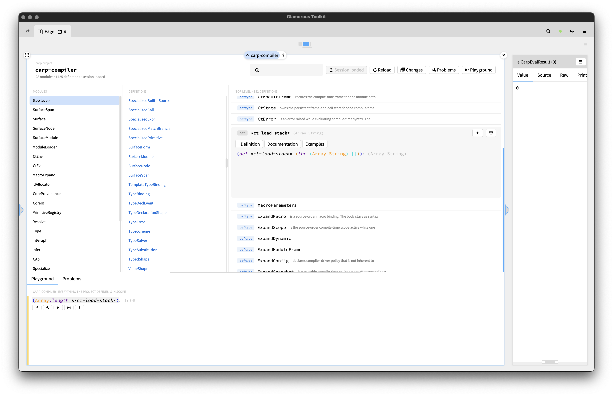

# Carp

contains Carp language support for the Glamorous Toolkit. Heavy WIP.



## Contents

The repository contains:
- A SmaCC parser for Carp,
- a highlighter and styler for Carp code inside GT,
- a snippet type for Carp Lepiter snippets,
- a server that keeps a warm compiler session per notebook page or project,
- a browser for Carp projects that edits definitions in their files,
- a booklet about the process of adding a language to GT.

## The server

`carp/src/server.carp` is a server that speaks length-prefixed JSON over TCP.
It links `carp-session` from the [self-hosting
compiler](https://github.com/cyberwitchery/metacarp), so a session loads
core once (or a whole project, which takes longer) and then answers warm:
inferred types, diagnostics, completion, documentation, macro expansion, and
the code generation a cell needs to run.

Building it needs either Carp compiler, but running it needs the
self-hosting one:

```
cd carp && carp --optimize -b src/server.carp
```

GT starts the server itself when nothing is listening. It looks for the
binary, the compiler and the standard library where this repository usually
sits, which you can override class-side on `CarpServerClient` or through the
`CARP_SERVER`, `CARP_COMPILER` and `CARP_DIR` environment variables.

## Installing

```
Metacello new
    baseline: 'Carp';
    repository: 'github://carpentry-org/gt4carp:master/src';
    load.

"this will also register the Lepiter booklet"
#BaselineOfCarp asClass loadLepiter
```

## Using it

A Carp snippet evaluates against its page's session. Definitions accumulate,
expressions answer a value, and the value is a live object. The program that
produced it stays alive and serves its own views, so a Carp value inspects in
GT the way a Pharo one does. Snippets also carry inferred types inline,
underline what does not compile, complete against everything the session can
see, and show documentation on hover.

A project is a git repository, and you can point the browser at one:

```
(CarpProject onRoot: '/path/to/repository') asBrowserTool
```

It reads the project the way the compiler would, so it lists modules and their
definitions with what the file says about them: documentation, declared
signature, visibility, implemented interfaces, and whether a definition is an
example. Editing a definition writes it back through its own span and commits
the file into the session, which is what the file coordinates are for. An open
definition shows its source, its documentation (editable), the examples that
exemplify it, and, for a type, the members the compiler derives for it.

Examples are ordinary definitions that say they are examples:

```
(meta-set! a-unit-circle "example" true)
(defn a-unit-circle [] (Circle.init 1.0))
```

What an example is an example *of* is not written down. It is what the example
returns, which is how it belongs to a type, and what it calls, which is how it
belongs to a function. We let the compiler figure it out, because that’s how
cool we are.

## Missing

Still left to do are:
- “finish” the IDE (i.e. bring to a stable, cute state),
- find a way to distribute the server,
- cache compiled core between cells, so running one costs the cell instead of
  the program around it,
- expand one macro step anywhere, rather than only at the top of a form, and
- get you involved!

<hr/>

Have fun!
